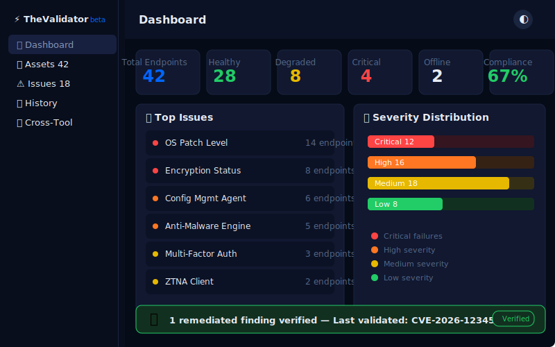

# TheValidator — Endpoint Health Checker

[](https://mrdchiang.github.io/security-tools/)
[](https://mrdchiang.github.io/thevalidator/)

A standalone, self-contained HTML dashboard for endpoint health validation, GPO drift detection, and fix verification. Part of the ShieldView family of security tools.

**Live:** https://mrdchiang.github.io/thevalidator/

---

## What It Does

TheValidator performs simulated agent health checks across security tools on endpoints. It detects GPO configuration drift by comparing actual endpoint settings against policy baselines, and verifies that RemFlow-deployed remediations actually resolved the issues.

| Feature | Description |
|---------|-------------|
| 📊 Dashboard | Total endpoints, health breakdown (healthy/degraded/critical/offline), compliance rate, top issues, cross-tool verification banner |
| 🖥️ Assets | 42 searchable/filterable assets with health status, check results, and software inventory |
| ⚠️ Issues | All failing checks grouped by severity and tool, with asset count breakdowns |
| 📋 History | Simulated check history timeline per endpoint |
| 🔗 Cross-Tool | Shows verified remediations from RemFlow pipeline |

### Demo Screenshots

#### Dashboard


The dashboard shows:
- **6 stat cards:** Total endpoints, healthy, degraded, critical, offline, compliance rate
- **Top issues** bar (most failing checks ranked)
- **Severity distribution** stacked bar
- **Cross-tool banner** when RemFlow has completed remediations to verify

#### Assets Page


- Search by hostname
- Filter by health (all, healthy, degraded, critical, offline)
- Filter by location
- Filter by OS
- Table: Hostname, OS, Location, Function, Health badge, Checks passing, Last Check
- Click any row → asset detail with per-check results

#### Detail Page


When clicking an asset:
- **System info:** IP, OS, Location, Function, Last Check
- **Check results table:** Tool name, Expected value, Actual value, Result badge (✅/❌/⚠)
- **Console vs Endpoint:** What the management console says vs what the endpoint reports
- **Actions:** Run Health Check, Export Report

---

## Architecture

```
┌──────────────┐     localStorage      ┌──────────────┐
│   RemFlow    │ ──────────────────→  │ TheValidator  │
│  (Remediate) │  validated-           │  (Verify)     │
└──────────────┘  remediations         └──────────────┘
```

TheValidator is the third step in the cross-tool pipeline. It reads from `security-tools:validated-remediations` and displays a verification banner on the dashboard.

### Cross-Tool Functions

```javascript
// Read pending remediations from ShieldView (for banner)
function checkCrossToolQueue() {
  try {
    return JSON.parse(localStorage.getItem('security-tools:remediation-queue') || '[]')
      .filter(i => i.status === 'pending');
  } catch(e) { return []; }
}

// Read validated remediations from RemFlow
function checkValidatedRemediations() {
  try {
    return JSON.parse(localStorage.getItem('security-tools:validated-remediations') || '[]');
  } catch(e) { return []; }
}
```

---

## To Build This For Real

TheValidator is a **client-side demo** — all data is client-generated. To build a production version:

### Step 1: Data Sources
Replace inline fake data with real APIs:

| Data | Fake Source | Real Source |
|------|------------|-------------|
| Endpoint inventory | `ASSETS[]` array | Microsoft Intune, Jamf, AD, SCCM |
| Health checks | Random pass/fail/warn | Endpoint Protection Agent API, ZTNA client API |
| GPO compliance | Simulated drift | Active Directory GPO results, PolicyAnalyzer |
| Software inventory | Random app list | SCCM Inventory, Intune managed apps |

### Step 2: Health Check Integration
```javascript
async function runHealthChecks(hostname) {
  const checks = [
    fetch(`/api/endpoint/${hostname}/protection/status`),
    fetch(`/api/endpoint/${hostname}/encryption/status`),
    fetch(`/api/endpoint/${hostname}/patching/status`),
    fetch(`/api/endpoint/${hostname}/ztna/status`),
  ];
  return Promise.all(checks.map(p => p.catch(() => ({ status: 'offline' }))));
}
```

### Step 3: GPO Drift Detection
```javascript
async function checkGPOCompliance(hostname) {
  const baseline = await fetch('/api/gpo/baseline').then(r => r.json());
  const actual = await fetch(`/api/endpoint/${hostname}/gpo/actuals`).then(r => r.json());
  return baseline.map(policy => ({
    ...policy,
    compliant: policy.expectedValue === actual[policy.name],
    actualValue: actual[policy.name]
  }));
}
```

### Step 4: Production Concerns
| Concern | Mitigation |
|---------|-----------|
| **Agent communication** | Use WebSocket or gRPC streaming for real-time check-in |
| **GPO baselines** | Store in version-controlled YAML, deploy via SCCM Baseline |
| **Verification frequency** | Configurable: every 15min critical / 1hr standard / daily non-critical |
| **Remediation verification** | After RemFlow deploy, automatically trigger health check on affected endpoints |
| **Reporting** | Export to CSV, PDF, or email weekly compliance summary |

---

## Data Shape

```javascript
// Asset
{ hostname: "CORP-WS7421", os: "Windows 11 Enterprise",
  location: "HQ-NYC", function: "Engineering",
  ip: "10.23.45.67", health: "healthy",
  checks: [
    { name: "Endpoint Protection Agent", category: "Security",
      expected: "Running", actual: "Running", result: "pass", lastVerified: "2026-07-08 14:22" },
    { name: "Encryption Status", category: "Compliance",
      expected: "Enabled", actual: "Enabled", result: "pass", lastVerified: "2026-07-08 14:22" },
    { name: "OS Patch Level", category: "Patching",
      expected: "Up-to-date", actual: "2 patches missing", result: "warn", lastVerified: "2026-07-08 12:00" }
  ],
  lastCheck: "2026-07-08 14:22" }

// Health check tools (all generic)
const TOOLS = [
  { name: "Endpoint Protection Agent", category: "Security" },
  { name: "Security Service", category: "Security" },
  { name: "Encryption Status", category: "Compliance" },
  { name: "Anti-Malware Engine", category: "Security" },
  { name: "Vulnerability Scanner Agent", category: "Security" },
  { name: "ZTNA Client", category: "Network" },
  { name: "Config Mgmt Agent", category: "Compliance" },
  { name: "OS Patch Level", category: "Patching" },
  { name: "Multi-Factor Auth", category: "Identity" }
];
```

### Health States
| State | Meaning | Color |
|-------|---------|-------|
| healthy | All checks passing | Green |
| degraded | ≥1 warning or minor failure | Orange |
| critical | ≥1 critical failure | Red |
| offline | No recent check-in | Gray |

### Check Results
| Result | Meaning |
|--------|---------|
| pass | Endpoint matches expected value |
| fail | Endpoint deviates from expected value |
| warn | Partial compliance or elevated risk |

### Critical Rule: No Vendor Names
All tool names are generic descriptions, not vendor products:
- ✅ `Endpoint Protection Agent`, `ZTNA Client`, `Encryption Status`
- ✅ `Config Mgmt Agent`, `Multi-Factor Auth`, `OS Patch Level`
- ❌ `CrowdStrike Falcon`, `Microsoft Defender`, `Zscaler`, `BitLocker`

---

## Deployment

```yaml
# .github/workflows/pages.yml
name: Deploy to GitHub Pages
on:
  push:
    branches: [main]
permissions:
  contents: read
  pages: write
  id-token: write
jobs:
  deploy:
    environment:
      name: github-pages
      url: ${{ steps.deployment.outputs.page_url }}
    runs-on: ubuntu-latest
    steps:
      - uses: actions/checkout@v4
      - uses: actions/configure-pages@v5
      - uses: actions/upload-pages-artifact@v3
        with:
          path: '.'
      - id: deployment
        uses: actions/deploy-pages@v4
```

Repo needs:
- `index.html` (the tool)
- `.nojekyll` (empty file)
- `.github/workflows/pages.yml` (auto-deploy)
- `404.html` (hash routing fallback)

---

## Files

| File | Purpose |
|------|---------|
| `index.html` | Main application (single-file) |
| `.nojekyll` | Disables Jekyll processing on GH Pages |
| `.github/workflows/pages.yml` | Auto-deploy workflow |
| `404.html` | Hash routing fallback for direct URLs |
| `README.md` | This file |

---

Built by David Chiang · [mrdavidchiang@gmail.com](mailto:mrdavidchiang@gmail.com)
